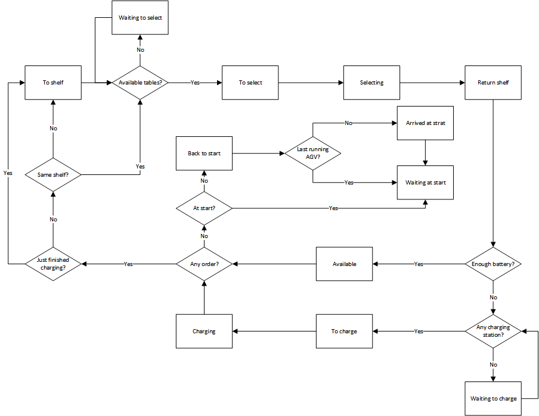
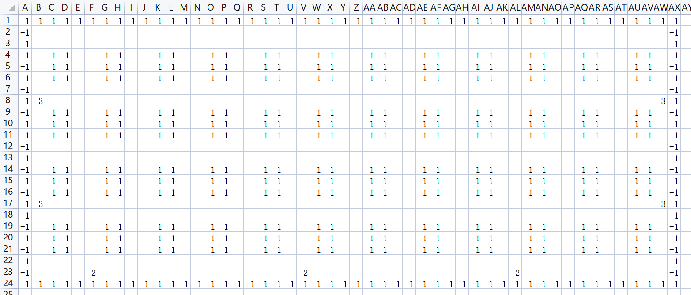

# Project Description

The Kiva system achieves automated sorting with goods-to-person through multi-AGV collaboration. The core of the system is the dynamic Multi-Agent Path Finding (MAPF) problem. This project simulates the Kiva-style automated sorting system using the CBS algorithm.

The default map of the project is a 22*48 grid map, as shown below:


AGVs can only move horizontally or vertically at a constant speed of 1 grid/time step. The start and stop times are not considered. Turning 90° requires 2 time steps, and turning 180° requires 3 time steps (customizable).

An order includes the positions of several target shelves and a workstation. The allocation logic assigns the target shelves to the nearest available AGV.

The order completion process is as follows:

1. Order issued
2. AGV departs from the starting point to the designated shelf
3. Lifts the shelf
4. Transports the shelf to the target workstation
5. Waits for the worker to pick
6. Returns the shelf to its original position
7. Lowers the shelf
8. Executes the next order

##### AGV State Transition Diagram



As shown in the figure, all AGVs are in the available state at the start of the simulation. After the nearest order is assigned, they enter the to shelf state (heading to the shelf). Upon reaching the shelf and lifting it, they check if the target workstation is occupied or reserved. If occupied, they enter the waiting to select state (waiting to sort). If not occupied, they enter the to select state (heading to sort). Upon reaching the workstation, they enter the selecting state (sorting). After sorting, they enter the return shelf state (returning the shelf). Upon reaching the shelf position, they check if the battery is sufficient. If below the threshold, they check if there is an available charging station. If not, they enter the waiting to charge state (waiting to charge). If there is an available charging station, they enter the to charge state (heading to charge). Upon reaching the charging station, they enter the charging state (charging). If the battery is sufficient, they re-enter the available state and continue to check for new orders. If there are no new orders, they check if the AGV is already at the starting point. If not, they enter the back to start state (returning to the starting point). Upon reaching the starting point, they check if the AGV is the last one to reach the starting point. If not, they enter the arrived at start state (this state causes all AGVs in motion to re-plan their paths to avoid passing through the starting point). If it is the last one, it directly enters the waiting at start state. When all AGVs enter the waiting at start state, the simulation ends. Additionally, an AGV that did not charge after completing the previous order will check if the target shelf of the new order is the same as the previous one. If so, it checks if the target workstation is available and enters the waiting to select or to select state.

# Required Libraries

To install the required libraries, run the following command:

```bash
pip install -r requirements.txt
```

# Directory Structure

```
├── README.md            
├── pics          
├── src                       
│   ├── a_star.py           
│   ├── agv.py                
│   ├── cbs.py                 
│   ├── mapAndOrder.py 
│   ├── main.py        
│   ├── visualization.py      
│   └── simulation.py                            
└── maps          
```

# Usage Instructions

Run the experiment in `src/main.py`.

Due to different monitor resolutions, the text in the generated visualization interface may vary in size, but the saved GIF interface will be normal.

##### Custom Map



As shown in the figure, -1 represents the map boundary (currently only rectangular maps are supported, with arbitrary map sizes), 1 represents shelves, 2 represents workstations, and 3 represents charging stations. The quantity and positions of these elements can be customized. Note the following:

1. Shelves and charging stations cannot be placed in the first row because the first row is the AGV entrance (starting point) by default.
2. Workstations can only be placed in the bottom row.
3. The boundary must be aligned with the first row and first column in Excel; otherwise, there may be issues with reading the map.

##### AGV Parameters

1. The custom AGV turning duration can be modified by changing the variables `TIME_OF_TURN90` and `TIME_OF_TURN180` in `a_star.py`. The default is 2 seconds for a 90° turn and 3 seconds for a 180° turn.
2. The full battery capacity of the AGV is defined by `FULL_CHARGE` in `agv.py`, with a default value of 3600 (since the M200 can work for 1 hour after charging for 10 minutes, 3600 represents full battery capacity, which can be consumed in approximately 3600 seconds (time steps)).
3. The battery consumption rate is defined by `BATTERY_CONSUMING_SPEED` in `agv.py`, with a default value of 1 (per time step).
4. The charging speed is defined by `CHARGING_SPEED` in `agv.py`, with a default value of 6 times the battery consumption rate (since the M200 can work for 1 hour after charging for 10 minutes, the charging speed is 6 times the consumption rate).

# Author

Zheng Chuyang, Student of the Department of Industrial Engineering, Tsinghua University. Email: zhengcy24@mails.tsinghua.edu.cn
