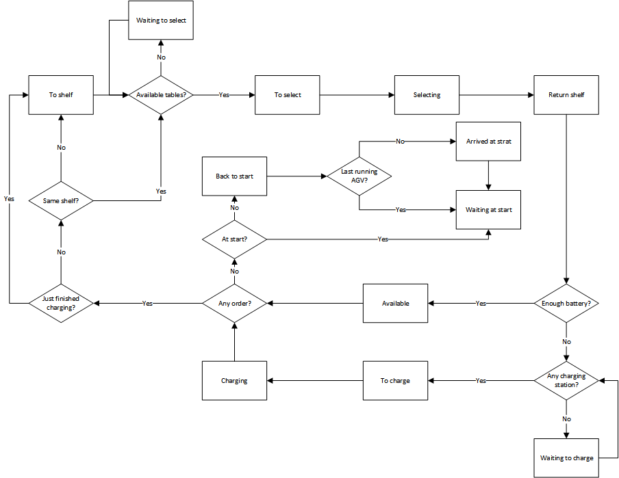
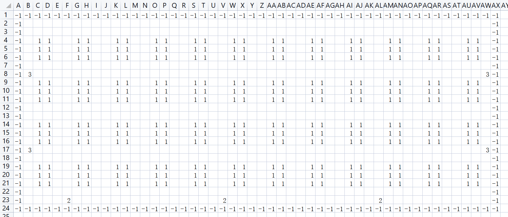

# Project Description

The Kiva system achieves automated sorting with goods-to-person through multi-AGV collaboration. The core of the system is the dynamic Multi-Agent Path Finding (MAPF) problem. This project simulates the Kiva-style automated sorting system using the CBS algorithm.

The default map of the project is a 22*48 grid map, as shown below:


AGVs can only move horizontally or vertically at a constant speed of 1 grid/time step. The start and stop times are not considered. Turning 90° requires 2 time steps, and turning 180° requires 3 time steps (customizable).

An order includes the positions of several target shelves and a workstation. The allocation logic assigns the target shelves to the nearest available AGV.

The order completion process is as follows:

1. Order issued
2. AGV departs from the starting point to the designated shelf
3. Lifts the shelf
4. Transports the shelf to the target workstation
5. Waits for the worker to pick
6. Returns the shelf to its original position
7. Lowers the shelf
8. Executes the next order

##### AGV State Transition Diagram



### Initial State
All AGVs begin in the `AVAILABLE` state at simulation startup, ready to receive order assignments.

### Order Assignment and Shelf Retrieval
1. **Order Assignment**: When an order is issued, the nearest available AGV is assigned and transitions to `TO_SHELF` state
2. **Shelf Retrieval**: AGV navigates to the designated shelf location and lifts it

### Workstation Assignment and Selection
3. **Workstation Check**: Upon reaching the shelf, the AGV evaluates target workstation availability:
   - **If workstation is occupied**: Transitions to `WAITING_TO_SELECT` state (waiting for workstation availability)
   - **If workstation is available**: Transitions to `TO_SELECT` state (heading to workstation)

4. **Sorting Process**: 
   - AGV reaches workstation and enters `SELECTING` state
   - Performs sorting operations for the specified duration
   - Upon completion, transitions to `RETURN_SHELF` state

### Shelf Return and Battery Management
5. **Shelf Return**: AGV transports shelf back to original position
6. **Battery Assessment**: Upon reaching shelf location, AGV checks battery level:
   - **If battery is sufficient**: Returns to `AVAILABLE` state for new orders
   - **If battery is below threshold**: Initiates charging sequence

### Charging Process
7. **Charging Station Assignment**:
   - **If charging station available**: Transitions to `TO_CHARGE` state (heading to charging station)
   - **If no station available**: Enters `WAITING_TO_CHARGE` state (waiting for available station)

8. **Charging Operations**: 
   - AGV reaches charging station and enters `CHARGING` state
   - Upon full charge, returns to `AVAILABLE` state

### End-of-Simulation Protocol
9. **Return to Start**: When no new orders are available:
   - **If not at starting point**: Transitions to `BACK_TO_START` state
   - **Upon reaching start**: 
     - If not the last AGV: Enters `ARRIVED_AT_START` state (triggers path re-planning for other AGVs)
     - If last AGV: Directly enters `WAITING_AT_START` state

10. **Simulation Termination**: When all AGVs reach `WAITING_AT_START` state, the simulation concludes

### Special Case: Consecutive Orders
For AGVs that complete an order without charging, an optimization check occurs:
- **If new order targets the same shelf**: AGV remains at shelf location
- **Workstation evaluation**: 
  - Available workstation → Direct transition to `TO_SELECT`
  - Occupied workstation → Transition to `WAITING_TO_SELECT`

# Required Libraries

To install the required libraries, run the following command:

```bash
pip install -e .
```

Alternatively, you can install the libraries listed in `requirements.txt` using the command below:

```bash
pip install -r requirements.txt
```

# Directory Structure

```
├── README.md                   # Project documentation
├── LICENSE                     # License file
├── main.py                     # Main execution script
├── pyproject.toml              # Project configuration
├── requirements.txt            # Python dependencies
├── todo.md                     # Project todo list
├── .gitignore                  # Git ignore rules
├── .env                        # Environment variables
├── src/                        # Source code directory
│   ├── kiva_sim/               # Main simulation package
│   │   ├── __init__.py
│   │   ├── agv.py              # AGV class and logic
│   │   ├── a_star.py           # A* pathfinding algorithm
│   │   ├── cbs.py              # Conflict-Based Search algorithm
│   │   ├── maps.py             # Map class and logic
│   │   ├── models.py           # Basic data models
│   │   ├── orders.py           # Order class and logic
│   │   ├── simulation.py       # Main simulation logic
│   │   ├── tables.py           # Table class and logic
│   │   ├── utils.py            # Utility functions
│   │   └── visualization.py    # Visualization components
├── pics/                       # Documentation images
├── gifs/                       # Demo animations
├── logs/                       # Simulation logs
└── experiment results/         # Experimental data and results
```

# Usage Instructions

Run the experiment in `main.py`.

Due to different monitor resolutions, the text in the generated visualization interface may vary in size, but the saved GIF interface will be normal.

##### Custom Map



As shown in the figure, -1 represents the map boundary (currently only rectangular maps are supported, with arbitrary map sizes), 1 represents shelves, 2 represents workstations, and 3 represents charging stations. The quantity and positions of these elements can be customized. Note the following:

1. Shelves and charging stations cannot be placed in the first row because the first row is the AGV entrance (starting point) by default.
2. Workstations can only be placed in the bottom row.
3. The boundary must be aligned with the first row and first column in Excel; otherwise, there may be issues with reading the map.

##### AGV Parameters

1. The custom AGV turning duration can be modified by changing the variables `TIME_OF_TURN90` and `TIME_OF_TURN180` in `a_star.py`. The default is 2 seconds for a 90° turn and 3 seconds for a 180° turn.
2. The full battery capacity of the AGV is defined by `FULL_CHARGE` in `agv.py`, with a default value of 3600 (since the M200 can work for 1 hour after charging for 10 minutes, 3600 represents full battery capacity, which can be consumed in approximately 3600 seconds (time steps)).
3. The battery consumption rate is defined by `BATTERY_CONSUMING_SPEED` in `agv.py`, with a default value of 1 (per time step).
4. The charging speed is defined by `CHARGING_SPEED` in `agv.py`, with a default value of 6 times the battery consumption rate (since the M200 can work for 1 hour after charging for 10 minutes, the charging speed is 6 times the consumption rate).

# Author

Zheng Chuyang, Student of the Department of Industrial Engineering, Tsinghua University. 

Email: zhengcy24@mails.tsinghua.edu.cn
